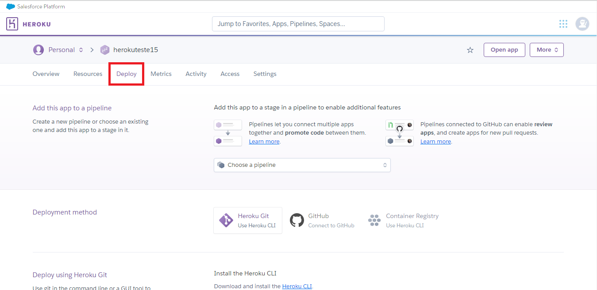
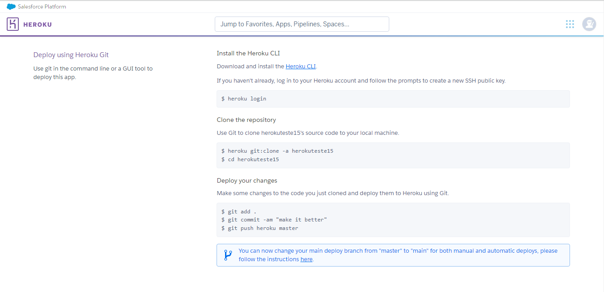

<h2 align = "center">Marketplace-Project</h2>

# Sobre
O projeto foi iniciado como parte de um trabalho para a matéria para Técnicas de Apresentação de Portfólio, da Faculdade de Design de Mídias Digitais, e consiste em criar um site de um marketplace, totalmente funcional. Algumas de suas funcionalidades são:

- Sistema de Cadastro.
- Sistema de Login.
- Página inicial com exibição de produtos.
- Página de fórum, permitindo que a comunidade tire dúvidas e opine sobre os produtos da loja.
- Cadastro com validação por Email.

Observação: Nem todos os recursos podem estar implementados e/ou funcionando corretamente. Para verificar quais são as funcionalidades implementadas consulte a guia "[Funcionalidades](#Funcionalidades)", mais abaixo.

Observação 2: O projeto é um teste de conceito e pode não conter práticas de segurança e/ou otimização adequadas ao ambiente de produção.

# Índice

* [Sobre](#sobre)
* [Índice](#índice)
* [Funcionalidades](#funcionalidades)
* [Demonstração](#demonstração)
* [Pré Requisitos](#pré-requisitos)
    * [Passos comuns ao modo local e online](passos-comuns-ao-modo-local-e-online)
* [Tecnologias](#tecnologias)
* [Autores](#autores)


# Funcionalidades

- [x] Sistema de Cadastro.
- [x] Sistema de Login.
- [x] Página inicial com exibição de produtos.
- [x] Página de fórum.
- [x] Cadastro com validação por Email.
- [ ] Página para alteração de dados cadastrais.


# Demonstração
  [](http://gamesplace.herokuapp.com/)

  imagens:

# Pré Requisitos

É necessário ter o python 3 instalado, bem como as bibliotecas Flask, flask-login, flask-mail e psycopg2 (se estiver usando PostgreSQL) ou mysql-connector (se estiver usando MySQL). Bibliotecas como pipenv podem ser interessantes para facilitar alguns processos de manipulação das pastas de ambiente virtual.

## Passos comuns ao modo local e online

- Criar um banco de dados em PostgreSQL ou MySQL (por enquanto, o site tem suporte a apenas essas duas plataformas, utilizando preferencialmente o PostgreSQL).

- Criar um email para feedback de informações do site (por hora, apenas o envio do código de validação do email cadastrado).

- Baixar os arquivos do repositório, utilizando o ````git clone https://github.com/vieiracodes/marketplace-project.git ```` ou  ````git clone https://github.com/Jherrerocavadas/Marketplace_Gamersplace.git ````.

As bibliotecas citadas no inicio dessa seção podem ser instaladas individualmente usando ````pip install nome_da_biblioteca```` ou por meio do arquivo ``requirements.txt``, presente na pasta raiz do repositório, usando ``pip install requirements.txt``.

- Criar um arquivo ``config.py`` baseado no arquivo de exemplo ``config_example.py``, substituindo os dados pelos dados de seu banco de dados e email de feedback. O arquivo pode ser encontrado na subpasta ``Back-End``. Atenção! Mantenha o arquivo ``config.py`` na mesma pasta do arquivo de exemplo.


para manipular e executar os arquivos do projeto.


## Para rodar o site localmente:

- Nesse momento, você já deve conseguir rodar seu aplicativo localmente digitando ````python Back-end\Gamesplace_app.py```` no terminal cmd ou bash direcionado na pasta raiz do projeto. Caso tenha alterado o nome do arquivo ``.py``, ou mesmo este, substitua o caminho do arquivo no comando, seguindo o exemplo: ```` python <caminho_do_arquivo>\<nome_do_arquivo.py>````.

- Abra o seu navegador e digite ````localhost:5000```` na barra de pesquisa. Caso a página tenha indicado algum erro, verifique se o terminal gerou algum erro e recarregue a página.

- Explore e aproveite as funcionalidades do site!

## Para rodar o site de forma online:
- Copie os arquivos ``Pipfile``, ``Pipfile.lock``, ``Procfile`` e ``requirements.txt``, contidos na raiz do projeto, para a pasta ``Deploy``, presente no repositório. Copie também o arquivo ``config.py``, criado anteriormente, para a mesma pasta.

- Caso tenha realizado modificações no código do site, copie o mesmo (denominado no repositório de ``Gamesplace_app.py``) para a pasta ``Deploy``, bem como quaisquer modificações das subpastas ``Back-end`` e ``front-end`` para as pastas de mesmo nome, contidas na pasta ``Deploy``.

- Crie um projeto na plataforma [Heroku](https://www.heroku.com/), e faça o envio da pasta ``Deploy`` para o projeto. Siga as instruções de como realizar a configuração e envio dos arquivos na aba **Deploy** do projeto, conforme as imagens abaixo, substituindo o nome de exemplo pelo nome atribuído ao seu projeto:

<h5 align="center">Aba de deploy</h5>


# <!-- Linha de divisão -->

<h5 align="center">Passo a passo para realização do deploy</h5>



- Terminado o deploy, acesse o link do seu projeto (ele deve se parecer com https://seu_projeto.herokuapp.com/).

- Compartilhe o link e aproveite as funcionalidades do site com mais pessoas!

Observações: É interessante ressaltar que a versão gratuita do Heroku possui algumas limitações relacionadas à disponibilidade do site: Ele fica 30 minutos em inatividade, e tem um tempo limite de acesso por mês, dependendo da quantidade de "dyno hours" que a sua conta tem restantes (as dyno hours são compartilhadas entre todos os projetos que você possui na conta, sendo consumidas de mesmo modo. Felizmente, a cada mês ocorre uma renovação das horas :) ).

# Tecnologias
- [Heroku](https://www.heroku.com/home)
- [PostgreSQL](https://www.postgresql.org/)
- [Python](https://www.python.org/)
- [Flask](https://flask.palletsprojects.com/en/2.2.x/)

# Autores
### Gabriel Vieira
[]()
[]()
[](https://github.com/vieiracodes)

### Johann Herrero Cavadas
[](https://www.linkedin.com/in/jherrerocavadas/)
[](mailto:jherrerocavadas@gmail.com?Subject=Contato%20github%20-%20Repositório%20Marketplace)
[](https://github.com/Jherrerocavadas)

# Lista de afazeres

Aqui segue uma lista de afazeres, para melhor organização e controle do projeto

Cada afazer realizado, **por favor marque copie e cole o " ✔️ " na frente !!**
Caso necessário, **coloque o icone " ⚠️ " na frente para definir prioridade**

## <!-- Linha de divisão -->
### Infraestrutura:
<!-- Trecho de código configurado como json -->
<!-- Para estilizar a seção de Infraestrutura -->

```` json
{
  "Hospedagem":{

    "Pesquisar servidores (se gratuitos, melhor)": "✔️",
    "Devem possuir suporte a banco de dados e back-end python" : "✔️",

    "Algumas Opções":{

      "- Vercel":" ",
      "- Heroku" : "✔️",
      "- InfinityFree" : " ",
    }
  }
}

````

## <!-- Linha de divisão -->
### Front-End:
<!-- Trecho de código configurado como HTML -->
<!-- Para estilizar a seção de Front-end -->

```` HTML
  <div class="Identidade Visual ✔️">
    <p> Criar uma logo para o marketplace ✔️ </p>
    <p> Criar um nome para o marketplace ✔️ </p>
    <p> Estabelecer uma paleta de cores ✔️ </p>

  </div>


  <div class="pag_login">
    <p> Criar o layout da pág de login ✔️ </p>
    <p> Criar o HTML e CSS da pág de login  ✔️ </p>
    <p> Criar animações e interatividade utilizando Js </p>
  </div>

  <div class="pag_principal">`
    <p> Criar o layout da pág principal ✔️ </p>
    <p> Criar o HTML e CSS da pág principal ✔️ </p>
    <p> Criar animações e interatividade utilizando Js ✔️ </p>
  </div>

  <div class="pag_adm">
    <p> Criar o layout da pág do ADM </p>
    <p> Criar o HTMl e CSS da pág principal </p>
    <p> Criar animações e interatividade utilizando Js </p>
  </div>


  <div class="forum">
    <p> Criar o layout do forum (e as subpáginas dos tópicos e criação de threads) ✔️ </p>
    <p> Criar o CSS da pág forum (e as subpáginas dos tópicos e criação de threads) </p>
    <p> Criar animações e interatividade utilizando Js </p>
  </div>

````

## <!-- Linha de divisão -->
### Back-End:
<!-- Trechos de código configurados com sintaxe python. -->
<!-- Para estilizar a seção de Back-end -->

  ```` python
def pag_login():
  'Criar um sistema de validação do e-mail ✔️'
  'Criar um sistema para guardar o login do usuário ✔️'
  'Criar um sistema para verificar se um e-mail está disponível ou já está em uso ✔️'


def pag_principal():
  'Criar um sistema onde, quando o usuário digitar algo na barra de pesquisa, apareça sugestões antes mesmo dele apertar o botão de busca ✔️'

  def market():

    # Criar sistema de carrinho (adição de itens, verificação do carrinho)
    # Criar sistema de "conclusão da compra" (simulação da compra)


def forum():
  'Criar sistema para abertura de posts(só quem estiver logado) ✔️'
  'Criar sistema para postagem de comentários (resposta a posts) ✔️'
  'Criar sistema para exibir (e também alterar) status do post (aberto, fechado, redundante) ✔️'
  'Criar sistema para exibir usuários que publicaram as perguntas e respostas✔️'
  'Sistema de permissões para publicar e responder posts (só quem estiver logado)✔️'


def alert():
  'Criar pop-ups de status (erros, ação bem sucedida)✔️'
  'Criar uma página personalizada de erros ✔️'
````


*/// Esse documento pode ser editado por qualquer um dos usuários, tanto para confirmar afazeres já feitos, quanto para adicionar novos afazeres.*
